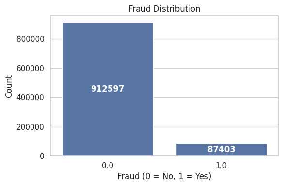
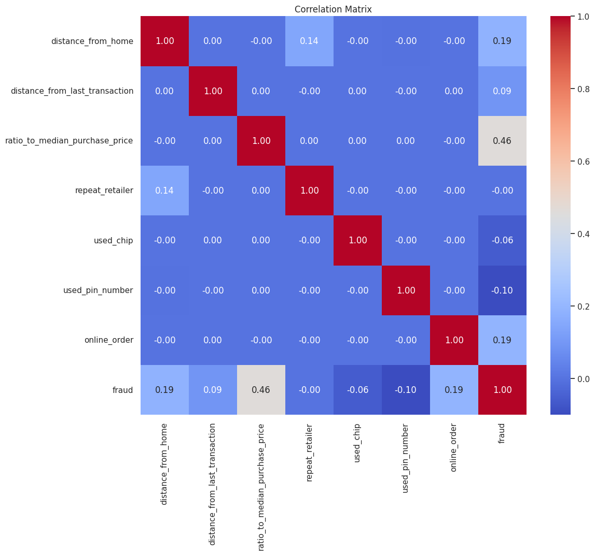
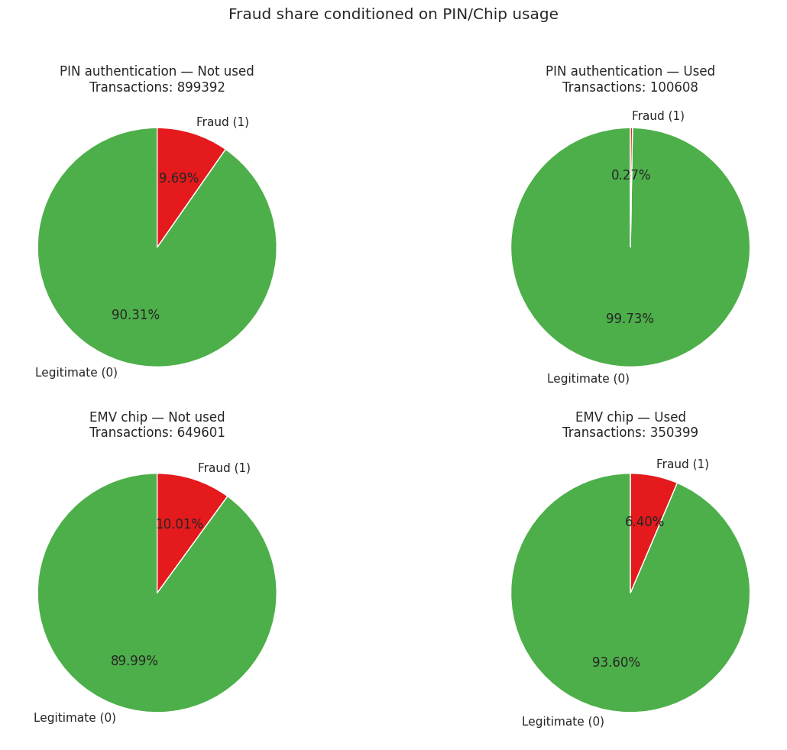
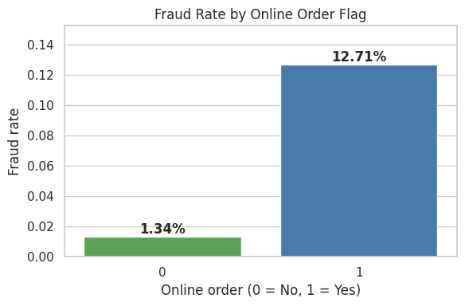

# Credit Card Fraud Detection: Exploratory Data Analysis & Financial Anomaly Profiling

[](https://colab.research.google.com/github/MSD-99/Credit_Card_Fraud_Detection_EDA_ML/blob/main/Credit_Card_Fraud_Analysis.ipynb)


A comprehensive exploratory data analysis, behavioral risk modeling, and financial anomaly detection study on **1,000,000 credit card transactions**.

---

## 📌 Executive Summary & Key Research Insights

Financial fraud detection presents significant machine learning challenges due to **extreme class imbalance**, multimodal transactional channels, and dynamic adversarial behavior.

| Dimension | Analytical Finding | Quantitative Impact |
| :--- | :--- | :---: |
| **Class Imbalance** | Legitimate transactions vastly outnumber fraud cases. | **8.74% Fraud vs. 91.26% Legitimate** |
| **Purchase Price Deviation** | Highest single predictor: outlier purchases relative to cardholder history. | **Pearson $r = +0.462$ with Fraud** |
| **PIN Authentication** | Using PIN authentication substantially reduces fraud vulnerability. | **99.7% of fraud events lacked PIN auth** |
| **Online vs. Point-of-Sale** | Card-Not-Present (CNP) online orders exhibit 3.8× higher fraud risk. | **Online: 12.7% Fraud vs. In-Store: 3.3%** |
| **Distance Discrepancy** | High geographic deviation from home and last transaction strongly signals stolen credentials. | Significant tail skewness ($p < 10^{-5}$) |

---

## 📊 Visual Analytics & Empirical Insights

### 1. Severe Class Imbalance & Feature Correlation
<p align="center">
  
  
</p>

### 2. Security Protocols & Behavioral Anomaly Impact
<p align="center">
  
  
</p>

---

## 🔬 Dataset Dictionary (1,000,000 Observations)

| Feature | Data Type | Description |
| :--- | :---: | :--- |
| `distance_from_home` | Float | Distance in kilometers from the cardholder primary residence. |
| `distance_from_last_transaction` | Float | Distance in kilometers from the previous recorded transaction. |
| `ratio_to_median_purchase_price` | Float | Ratio of current transaction amount to cardholder historical median. |
| `repeat_retailer` | Binary ($0/1$) | Whether transaction occurred at a previously visited merchant. |
| `used_chip` | Binary ($0/1$) | Whether physical EMV chip mechanism was engaged. |
| `used_pin_number` | Binary ($0/1$) | Whether valid PIN authentication was supplied. |
| `online_order` | Binary ($0/1$) | Whether transaction occurred via web/ecommerce portal. |
| **`fraud` (Target)** | Binary ($0/1$) | Target variable ($1 = \text{Fraudulent}, 0 = \text{Legitimate}$). |

---

## 📁 Repository Structure

```text
├── Credit_Card_Fraud_Analysis.ipynb  # Comprehensive interactive notebook with full outputs & charts
├── data/
│   └── card_transdata_sample.csv    # 2,000-row lightweight test sample
├── figures/                         # High-resolution generated analytic plots
│   ├── fraud_class_distribution.png
│   ├── feature_correlation_matrix.png
│   ├── security_protocols_pie_charts.png
│   ├── purchase_price_ratio_vs_fraud.png
│   └── online_vs_offline_fraud_rates.png
├── requirements.txt                 # Dependencies
├── .gitignore                       # Git exclusions
└── README.md                        # Project documentation
```

---

## 🚀 Quickstart & Interactive Reproduction

### Option A: Google Colab (Instant One-Click Run)
Click to open and execute directly in Colab:  
[](https://colab.research.google.com/github/MSD-99/Credit_Card_Fraud_Detection_EDA_ML/blob/main/Credit_Card_Fraud_Analysis.ipynb)

### Option B: Local Execution
```bash
# Clone the repository
git clone https://github.com/MSD-99/Credit_Card_Fraud_Detection_EDA_ML.git
cd Credit_Card_Fraud_Detection_EDA_ML

# Install dependencies
pip install -r requirements.txt

# Launch JupyterLab
jupyter lab Credit_Card_Fraud_Analysis.ipynb
```
